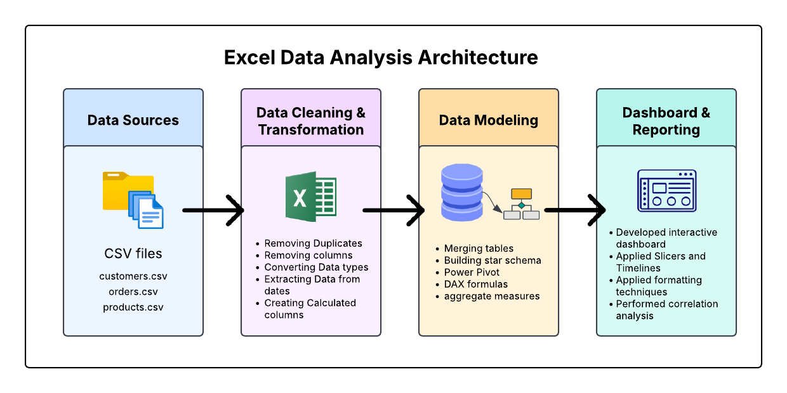
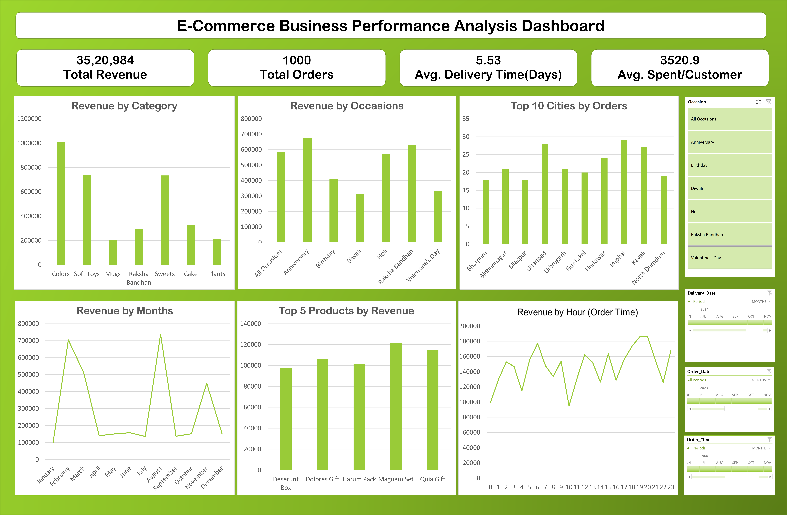
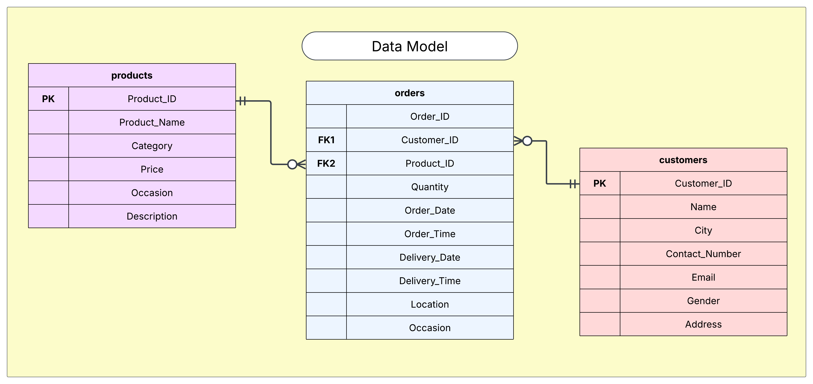

# E-commerce Analytics Dashboard: Data-Driven Decision Making

## Excel-Based Data Analysis Portfolio Project

Welcome to my E-commerce Analytics portfolio project! This repository demonstrates my approach to transforming raw E-commerce  data into actionable business insights through Excel-based analytics techniques for FNP (Ferns & Petals), a fictitious online gifting company.

---

## Project Overview

This project showcases my ability to analyze E-commerce data to extract meaningful business insights. Using a E-commerce gift platform dataset as my foundation, I developed an end-to-end analytics solution that answers critical business questions:

- How can revenue patterns be analyzed across multiple dimensions (time, product, occasion)?
- What insights can we derive about customer spending behavior?
- How do operational metrics like delivery time impact business performance?
- Which products, categories, and occasions drive the most value?

By addressing these questions, I demonstrate my capability to turn raw data into strategic recommendations that drive business decisions.

---

## Technical Skills Demonstrated

This project highlights my proficiency in the following areas:

**Excel Data Analysis & Visualization:**
- Advanced Excel functions and features
- Power Query for ETL processes
- Power Pivot for data modeling and relationships
- DAX functions for calculated measures
- PivotTables and interactive charts

**Analysis Techniques:**
- Time series analysis (monthly, daily, and hourly patterns)
- Product performance metrics and category analysis
- Geographic distribution analysis
- Correlation analysis (order quantity vs. delivery time)

**Data Engineering:**
- ETL pipeline development using Power Query
- Data cleaning and transformation
- Data quality validation
- Structured data modeling in a star schema

---

## The Analytics Architecture

I implemented a systematic data analysis framework, showcasing my methodology from raw data to actionable insights:

### The Data Pipeline:

**1. Data Source Integration**
- Imported multiple CSV data sources (customers, orders, products) using Excel's Get Data feature
- Performed initial assessment of data quality and structure
- Established consistent data loading processes

**2. Data Transformation & Preparation**
- Cleansed and standardized inconsistent data formats
- Removed unnecessary columns (e.g., product descriptions in non-relevant languages)
- Converted data types (e.g., phone numbers to text)
- Created calculated fields for business metrics:
  - Revenue (Price × Quantity)
  - Delivery time (days between order and delivery)
  - Month and day name extractions for temporal analysis

**3. Data Modeling & Analytics**
- Constructed a dimensional star schema using Power Pivot
- Created relationships between orders (fact table) and dimension tables (customers, products)
- Developed calculated measures using DAX
- Applied statistical methods to uncover correlations between order quantity and delivery times

**4. Visualization & Reporting**
- Designed an intuitive, interactive dashboard using Excel charts
- Implemented slicers and timelines for dynamic filtering
- Created purpose-built visualizations for specific analytical questions
- Applied formatting techniques for clarity and visual appeal

This structured approach demonstrates my ability to implement best practices in data analytics using Excel, ensuring both analytical rigor and business relevance.

---

## Key Analytical Components

### 1. Revenue Analysis Framework

My multi-dimensional revenue analysis demonstrates my ability to examine business performance across various perspectives:

- **Temporal Analysis**: Identified significant revenue spikes in February and September, with clear hourly purchasing patterns peaking between 5-7 PM and 10-11 PM
- **Product Hierarchy**: Analyzed performance at the product and category level, identifying "Colors" and "Sweets" as top-performing categories, and "Magnam Set" and "Quia Gift" as best-selling products
- **Customer Segments**: Calculated average customer spend of ₹3,520.90, providing insights into customer value
- **Geographic Distribution**: Mapped revenue concentration by city, identifying Jaipur, Kanpur, and North Dumdum as top-performing markets

### 2. Operational Metrics Dashboard

I developed comprehensive operational KPIs to provide actionable intelligence:

- **Order Fulfillment Metrics**: Calculated an average delivery time of 5.53 days with variance analysis
- **Efficiency Analysis**: Order volume impact on operational metrics
- **Performance Tracking**: Sales performance across different time periods and occasions, with Anniversary and Holi identified as highest-revenue occasions

### 3. Customer Behavior Analysis

My approach to understanding customer behavior included:

- **Spending Patterns**: Average order value analysis across customer segments
- **Occasion-Based Purchasing**: Identified purchasing patterns tied to special occasions, with clear preferences for Anniversary and Holi-related gifts
- **Geographic Segmentation**: City-level analysis to identify top markets by order volume
- **Temporal Behavior**: Identified key purchasing hours (5-7 PM and 10-11 PM) to optimize marketing timing

### 4. Statistical Applications

To demonstrate my quantitative skills, I applied statistical methods:

- **Correlation Analysis**: Identified relationships between order quantity and delivery times
- **Aggregation Analysis**: Used various summary statistics to understand data distributions
- **Trend Analysis**: Tracked performance over time to identify seasonal patterns and opportunities

---

## Technical Implementation Details

### Data Preparation Techniques

I utilized Power Query Editor as an ETL (Extract, Transform, Load) tool to:

- Convert data types for consistency
- Extract temporal components (month names, day names) from date fields
- Create calculated columns for metrics like delivery duration
- Merge tables on common fields (e.g., Product ID) to bring in related data

### Advanced Excel Functions Applied

- **DAX Formulas**: For calculated measures like revenue (Price × Quantity)
- **Power Pivot**: For creating relationships between tables in a star schema
- **PivotTables**: For dynamic data aggregation and analysis
- **Excel Charts**: For visualizing key metrics and trends

### Dashboard Development Approach

My interactive dashboard implementation demonstrates:

- **User-Centered Design**: Focused on answering key business questions
- **Visual Hierarchy**: Strategic arrangement of KPIs and visualizations
- **Filter Integration**: Slicers and timelines for dynamic data exploration
- **Consistent Formatting**: Applied custom labels, legends, and color themes

---

## Business Intelligence Insights

My analysis uncovered several actionable insights that showcase my ability to translate data into business value:

### Revenue & Product Performance

- **Category Performance**: "Colors" and "Sweets" emerged as top-performing categories by revenue, while "Mugs" and "Plants" showed lower performance
- **Product Champions**: Identified "Magnam Set" and "Quia Gift" as the highest revenue-generating products
- **Seasonal Revenue Patterns**: Discovered significant revenue spikes in February (likely Valentine's Day) and September
- **Occasion-Based Analysis**: Determined that Anniversary and Holi occasions drove the most orders and revenue

### Operational Efficiency

- **Delivery Performance**: Established that the current average delivery time is 5.53 days
- **Peak Order Times**: Identified highest ordering activity between 17-19 hours (5-7 PM) and 22-23 hours (10-11 PM)
- **Regional Performance**: Mapped geographic performance variations, with Jaipur, Kanpur, and North Dumdum showing strongest performance

### Customer Insights

- **Customer Value**: Calculated average customer spend of ₹3,520.90
- **Geographic Distribution**: Identified top cities by order volume and revenue
- **Purchasing Behavior**: Analyzed relationships between occasions, product categories, and customer location

---

## Data-Driven Recommendations

Based on the dashboard insights, I've developed the following strategic recommendations:

1. **Leverage Seasonal Peaks**
   - Plan more aggressive marketing campaigns for February and September
   - Increase inventory preparation for these peak months
   - Develop seasonal product offerings tailored to these high-revenue periods

2. **Optimize Product Categories**
   - Expand "Colors" and "Sweets" product lines as top-performing categories
   - Create bundle offers combining best-selling products
   - Refresh product offerings in underperforming categories like "Mugs" and "Plants"

3. **Focus on Occasion-Based Marketing**
   - Develop more targeted promotional campaigns around Anniversary and Holi
   - Strengthen marketing for underperforming occasions like Diwali
   - Create occasion-specific bundled offerings for high-value events

4. **Geographic Expansion Strategy**
   - Increase marketing spend in top-performing cities (Jaipur, Kanpur, North Dumdum)
   - Develop growth strategies for moderately performing cities
   - Consider targeted promotions to boost performance in lower-performing regions

5. **Hourly Sales Optimization**
   - Time flash sales, email campaigns, and social media posts during peak periods (5-7 PM and 10-11 PM)
   - Schedule inventory restocking and customer service coverage during high-activity windows
   - Test promotions during non-peak hours to increase overall sales distribution

6. **Product Development Roadmap**
   - Create variations or complementary products based on bestsellers like "Magnam Set" and "Quia Gift"
   - Consider phasing out or revitalizing consistently underperforming products
   - Test new product introductions based on existing category performance

7. **Delivery Time Reduction**
   - Work to reduce the 5.53-day average delivery time to improve customer satisfaction
   - Analyze delivery performance by region to identify improvement opportunities
   - Consider premium shipping options as an additional revenue stream

8. **Customer Lifetime Value Optimization**
   - Implement cross-selling and upselling strategies to increase the ₹3,520.90 average spend
   - Develop a loyalty program to encourage repeat purchases
   - Introduce premium product offerings for high-value customers

---

## Technical Skills Summary

This project demonstrates my proficiency in:

- **Excel Mastery**: Advanced functions, Power Query, Power Pivot, DAX formulas
- **Data Visualization**: Chart design, dashboard development, interactive elements
- **Data Modeling**: Star schema implementation, relationship design
- **Data Transformation**: ETL processes, data cleaning, feature engineering
- **Business Intelligence**: KPI development, metric design, performance analysis
- **Technical Communication**: Data storytelling, executive summary creation, documentation

---

## Project Integration

To complete this project, I also:

- Leveraged AI tools to generate an executive summary of key findings
- Created comprehensive documentation of the analysis process
- Compiled all project components into a shareable repository
- Developed a one-page PDF summary of the project
- Shared project highlights through professional networking

---

## Conclusion

This project demonstrates my ability to transform raw E-commerce data into meaningful business insights using Excel's powerful data analysis capabilities. By implementing a complete analytical workflow—from data extraction and cleaning to modeling and visualization—I've shown how Excel can serve as an effective platform for business intelligence in E-commerce  environments. Most importantly, I've demonstrated how data analysis can lead to concrete, actionable recommendations that drive business value.
